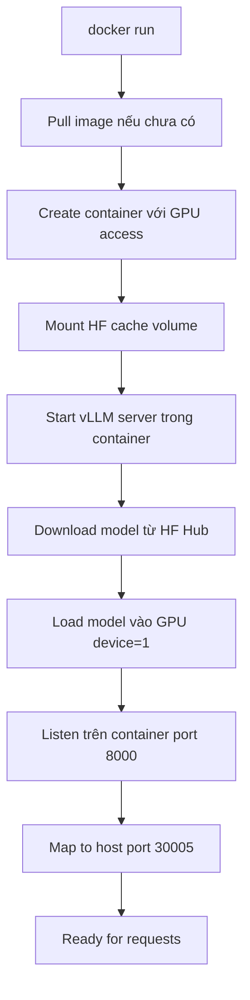

## 🐳 **Bản chất của Docker command này**

Đây là cách **deploy vLLM bằng Docker container** thay vì cài đặt trực tiếp trên máy host. Về bản chất, nó làm **cùng một việc** với lệnh Python trước đó, nhưng chạy trong môi trường **isolated container**.

---

## 🔍 **Phân tích từng thành phần:**

### **`docker run --runtime nvidia --gpus '"device=1"'`**
- **Bản chất**: Khởi chạy container với quyền truy cập GPU
- **--runtime nvidia**: Sử dụng NVIDIA Container Runtime để truy cập CUDA
- **--gpus device=1**: Chỉ dùng GPU số 1 (thay vì tất cả GPUs)
- **Tương đương**: Như `CUDA_VISIBLE_DEVICES=1` trong host

### **`-v ~/.cache/huggingface:/root/.cache/huggingface`**
- **Bản chất**: **Volume mounting** - chia sẻ cache giữa host và container
- **Mục đích**: Tránh download model nhiều lần
- **Host path**: `~/.cache/huggingface` (cache trên máy của bạn)
- **Container path**: `/root/.cache/huggingface` (cache trong container)

### **`-p 30005:8000`**
- **Bản chất**: **Port mapping** từ container ra host
- **30005**: Port trên host machine (external)
- **8000**: Port bên trong container (internal)
- **Kết quả**: Truy cập `http://localhost:30005` từ bên ngoài

### **`--ipc=host`**
- **Bản chất**: Chia sẻ **Inter-Process Communication** với host
- **Mục đích**: Cải thiện performance cho multi-GPU communication
- **Cần thiết**: Khi dùng tensor parallelism

### **`vllm/vllm-openai:v0.4.2`**
- **Bản chất**: **Pre-built Docker image** đã có sẵn vLLM
- **Nội dung**: Ubuntu + Python + vLLM + CUDA + dependencies
- **Tương đương**: Máy ảo đã cài đặt sẵn mọi thứ

### **`--model Qwen/Qwen2.5-1.5B-Instruct`**
- **Bản chất**: Model từ Hugging Face Hub (không phải local)
- **Khác biệt**: Dùng model gốc từ HF, chưa fine-tune
- **Download**: Tự động tải về khi chạy lần đầu

---

## 🤔 **Tại sao không cần `pip install vllm`?**

### **Docker Image đã có sẵn mọi thứ:**

```dockerfile
# Bên trong vllm/vllm-openai:v0.4.2
FROM nvidia/cuda:12.1-devel-ubuntu22.04

RUN pip install vllm==0.4.2
RUN pip install transformers torch fastapi uvicorn
# ... other dependencies

ENTRYPOINT ["python", "-m", "vllm.entrypoints.openai.api_server"]
```

**→ Giống như bạn đã có một máy tính ảo được cài đặt sẵn vLLM!**

---

## 📊 **So sánh 2 phương pháp:**

| Aspect | Host Installation | Docker Container |
|--------|------------------|------------------|
| **Setup** | `pip install vllm` | `docker pull vllm/vllm-openai` |
| **Dependencies** | Cần manage manually | ✅ Pre-installed |
| **Isolation** | Ảnh hưởng system | ✅ Isolated environment |
| **Portability** | Tied to host | ✅ Run anywhere |
| **Resource** | Direct access | Small overhead (~100MB RAM) |
| **Debugging** | Easier | Harder (need docker exec) |

---

## 🔄 **Quy trình hoạt động:**



---

## 🌐 **Network flow:**

```
[External Client] 
    ↓ 
[Host:30005] 
    ↓ (port mapping)
[Container:8000] 
    ↓ 
[vLLM Server] 
    ↓ 
[GPU device=1]
```

---

## 🔧 **Điều chỉnh để dùng model đã fine-tune:**

### **Option 1: Mount local model**
```bash
docker run --runtime nvidia --gpus '"device=1"' \
    -v ~/.cache/huggingface:/root/.cache/huggingface \
    -v /path/to/merged_qwen3_finetuned:/app/model \
    -p 30005:8000 \
    --ipc=host \
    vllm/vllm-openai:v0.4.2 \
    --model /app/model \
    --api-key hoailb-vllm \
    --gpu-memory-utilization 0.7 \
    --trust-remote-code
```

### **Option 2: Copy vào image**
```dockerfile
FROM vllm/vllm-openai:v0.4.2
COPY ./merged_qwen3_finetuned /app/model
```

---

## 🎛️ **Tham số bổ sung giải thích:**

### **`--api-key hoailb-vllm`**
- **Bản chất**: API authentication key
- **Sử dụng**: Client phải gửi `Authorization: Bearer hoailb-vllm`

### **`--max-num-seqs 16`**
- **Bản chất**: Số requests đồng thời tối đa
- **16**: Xử lý tối đa 16 requests cùng lúc

### **`--block-size 16`**
- **Bản chất**: Size của memory blocks cho PagedAttention
- **Impact**: Ảnh hưởng memory fragmentation

### **`--swap-space 4`**
- **Bản chất**: 4GB swap space cho overflow
- **Mục đích**: Khi GPU memory đầy, swap sang CPU RAM

---

## 💡 **Ưu điểm của Docker approach:**

1. **🔒 Isolation**: Không ảnh hưởng system dependencies
2. **📦 Portability**: Chạy được trên bất kỳ máy có Docker + GPU
3. **⚡ Quick setup**: Không cần cài đặt phức tạp
4. **🔄 Reproducible**: Same environment everywhere
5. **🛡️ Security**: Container sandbox
6. **🚀 Scaling**: Dễ deploy multiple instances

---

## 🎯 **TL;DR:**

**Docker command này = "Thuê một máy tính ảo đã cài sẵn vLLM" thay vì "Cài vLLM trên máy của bạn"**

- ✅ **Pre-built environment**: Không cần `pip install` gì cả
- ✅ **GPU access**: Container được phép dùng GPU device=1  
- ✅ **Port forwarding**: Truy cập qua `localhost:30005`
- ✅ **Cache sharing**: Không phải tải model nhiều lần
- ✅ **Isolated**: Không làm "bẩn" máy host

**Giống như difference giữa "cài app trên máy" vs "chạy app portable"! 🚀**