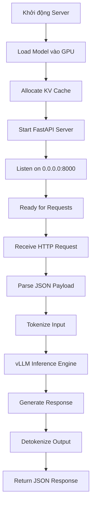

## 🎯 **Bản chất của lệnh này là gì?**

Lệnh này **khởi tạo một HTTP REST API server** sử dụng vLLM engine để serve mô hình Qwen3 đã fine-tune của bạn, với giao diện tương thích OpenAI API.

---

## 🧠 **Phân tích từng thành phần:**

### **`python -m vllm.entrypoints.openai.api_server`**
- **Bản chất**: Khởi chạy một **FastAPI web server** 
- **Chức năng**: Tạo các endpoint HTTP như `/v1/chat/completions`, `/v1/models`
- **So sánh**: Giống như chạy `uvicorn app:app --host 0.0.0.0 --port 8000`

### **`--model ./merged_qwen3_finetuned`**
- **Bản chất**: Tải mô hình đã merge từ thư mục local
- **Hoạt động**: 
  ```python
  # Tương đương:
  from vllm import LLM
  llm = LLM(model="./merged_qwen3_finetuned")
  ```

### **`--host 0.0.0.0 --port 8000`**
- **Bản chất**: Cấu hình network binding
- **0.0.0.0**: Lắng nghe tất cả network interfaces (có thể truy cập từ external)
- **8000**: Port HTTP server
- **Tương đương**: `app.run(host="0.0.0.0", port=8000)`

### **`--tensor-parallel-size 1`**
- **Bản chất**: Chia mô hình ra **1 GPU** (single GPU mode)
- **Hoạt động**: Không split model weights across GPUs
- **Nếu = 2**: Chia mô hình ra 2 GPU để tăng tốc

### **`--gpu-memory-utilization 0.8`**
- **Bản chất**: Sử dụng **80% VRAM** để cache KV (Key-Value attention cache)
- **Lý do**: Để lại 20% VRAM cho CUDA operations và buffer
- **Ví dụ**: GPU 12GB → dùng ~9.6GB cho model + cache

### **`--max-model-len 2048`**
- **Bản chất**: Giới hạn **context window** tối đa 2048 tokens
- **Hoạt động**: Truncate input/output nếu vượt quá
- **Memory impact**: Ảnh hưởng đến KV cache size

### **`--trust-remote-code`**
- **Bản chất**: Cho phép chạy **custom Python code** trong mô hình
- **Cần thiết cho**: Qwen3 (có custom modeling code)
- **Tương đương**: `trust_remote_code=True` trong transformers

---

## ⚙️ **Quy trình hoạt động bên trong:**



---

## 🔍 **Điều gì xảy ra khi chạy lệnh:**

### **Bước 1: Model Loading (30-60s)**
```
INFO: Loading model ./merged_qwen3_finetuned
INFO: Model config: Qwen3ForCausalLM
INFO: Model size: 1.7B parameters
```

### **Bước 2: Memory Allocation** 
```
INFO: GPU memory utilization: 0.8
INFO: KV cache size: 1.2GB
INFO: Model weights: 3.4GB
```

### **Bước 3: Server Start**
```
INFO: Started server on http://0.0.0.0:8000
INFO: Waiting for requests...
```

---

## 📡 **API Endpoints được tạo ra:**

| Endpoint | Mục đích | Tương đương OpenAI |
|----------|-----------|-------------------|
| `GET /v1/models` | List available models | ✅ |
| `POST /v1/chat/completions` | Chat inference | ✅ |
| `POST /v1/completions` | Text completion | ✅ |
| `GET /health` | Health check | ❌ (vLLM specific) |

---

## 🎭 **So sánh với các phương pháp khác:**

### **vLLM Server vs Transformers**
```python
# Transformers (chậm, single request)
from transformers import AutoModelForCausalLM
model = AutoModelForCausalLM.from_pretrained("./merged_qwen3_finetuned")
# Mỗi lần generate() tốn 2-3s

# vLLM Server (nhanh, concurrent requests)  
# curl http://localhost:8000/v1/chat/completions
# Mỗi request chỉ 200-500ms
```

### **vLLM Server vs Ollama**
- **Ollama**: Dễ setup nhưng slower, ít control
- **vLLM**: Nhanh hơn nhưng cần hiểu biết technical

---

## 💡 **Tại sao chọn phương pháp này?**

1. **🚀 Performance**: Continuous batching, PagedAttention
2. **🔄 Concurrent**: Xử lý nhiều requests cùng lúc
3. **📦 OpenAI Compatible**: Drop-in replacement
4. **⚡ Memory Efficient**: KV cache optimization
5. **🎛️ Production Ready**: Health checks, metrics

---

## 🔧 **Tương đương với code Python thuần:**

```python
# Điều server làm bên trong (simplified)
from vllm import LLM, SamplingParams
from fastapi import FastAPI
import uvicorn

app = FastAPI()
llm = LLM(model="./merged_qwen3_finetuned", 
          gpu_memory_utilization=0.8,
          max_model_len=2048)

@app.post("/v1/chat/completions")
async def chat_completions(request):
    prompt = format_chat_template(request.messages)
    output = llm.generate([prompt], SamplingParams(max_tokens=100))
    return {"choices": [{"message": {"content": output[0].outputs[0].text}}]}

# Chạy server
uvicorn.run(app, host="0.0.0.0", port=8000)
```

---

## 🎯 **TL;DR - Bản chất:**

**Lệnh này tạo ra một HTTP API server chuyên dụng để serve mô hình AI của bạn với:**
- ✅ Tốc độ cao (vLLM engine) 
- ✅ Giao diện chuẩn (OpenAI API)
- ✅ Xử lý đồng thời (concurrent requests)
- ✅ Tối ưu memory (GPU cache management)

**Giống như biến mô hình AI của bạn thành một "ChatGPT API" riêng chạy trên máy local! 🤖**